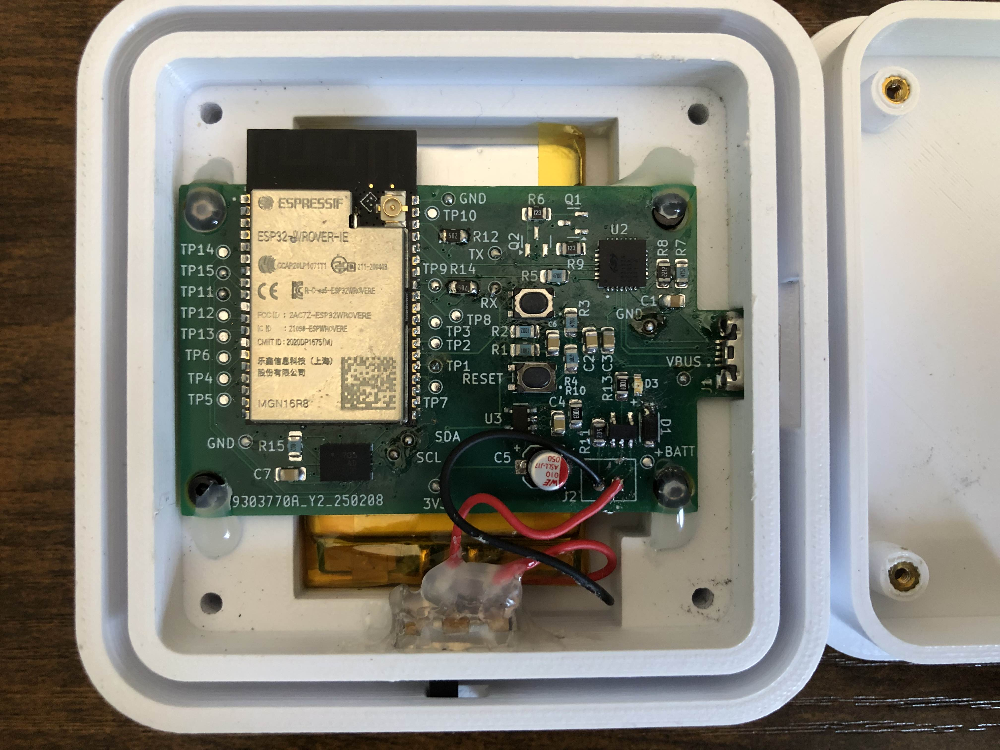
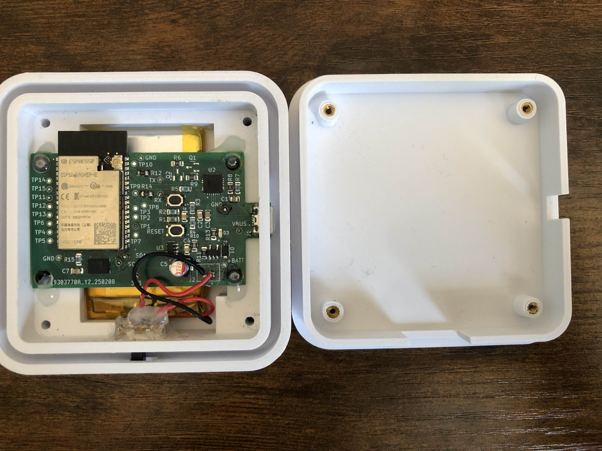
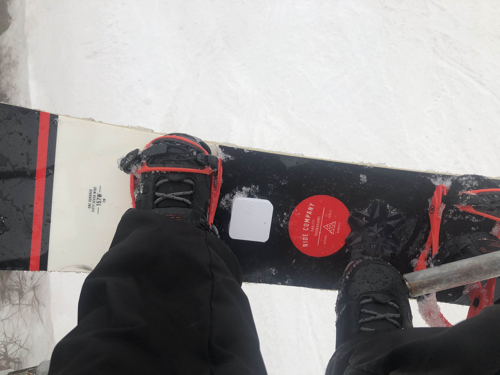
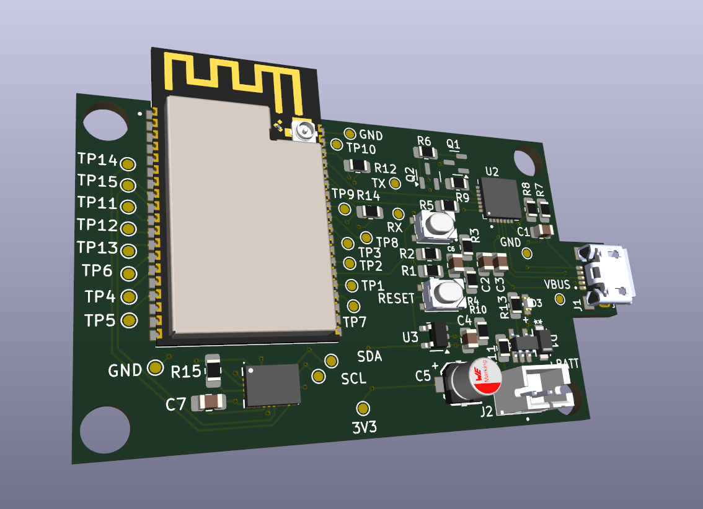

# Snowboard-Recorder-PCB
## Purpose
I designed this board for a Software Engineering class project. The PCB was made to facilitate communication between a ESP32-WROVER SoC and BNO086 IMU which the ESP32 then reports constant updates to a mobile app through Bluetooth. In practice, the PCB is installed into a housing which is then mounted on a snowboard.
## Remarks
I2C should not have been used to communicate with the BNO086 because the updated ESP32 I2C driver does not support SCL-stretching, which the BNO086 needs to communicate without issues arising. Only the legacy ESP-IDF driver consisitently works with it. SPI should have been used in place of I2C.
## Pictures

